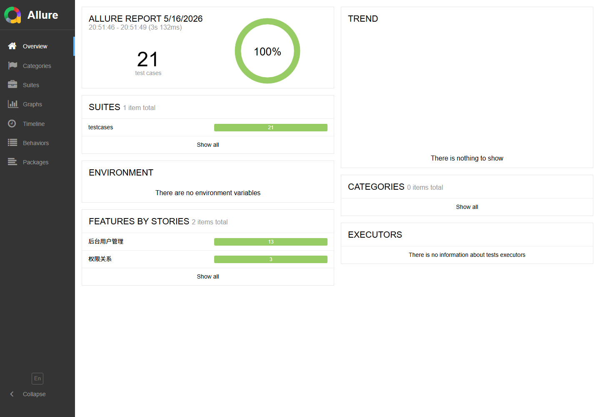

# mall-tiny 接口自动化测试

这是一个基于 mall-tiny 后台权限管理系统的接口自动化测试项目，主要覆盖登录、用户信息、用户列表权限控制、用户详情、后台用户 CRUD 和数据库一致性校验。

项目重点不只是把接口调通，而是围绕后台权限体系做验证：不同角色拿到不同 token 后，访问同一接口应该返回不同业务结果；接口返回的数据也会和数据库做交叉校验，保证业务表现和底层数据一致。

## 技术栈

- Python
- requests
- pytest
- PyYAML
- PyMySQL
- Allure
- GitHub Actions

## 项目结构

```text
mall_tiny_test/
├── .github/workflows/        # GitHub Actions CI 配置
│   └── ci.yml
├── common/                   # 公共工具层：请求封装、YAML 读取、数据库查询
│   ├── request_util.py        # 统一处理 base_url、timeout、token 和请求发送
│   ├── yaml_util.py           # YAML 配置/测试数据读取
│   └── db_util.py             # MySQL 查询和测试数据清理能力
├── config/                   # 环境配置目录
│   ├── config.example.yaml    # 配置模板，可提交到仓库
│   └── config.yaml            # 本地真实配置，包含账号/数据库信息，不提交
├── data/                     # 测试数据
│   ├── login_data.yaml        # 登录失败场景数据
│   └── admin_data.yaml        # 用户列表、临时用户测试数据
├── docs/images/              # README 展示图片
│   └── allure-overview.png
├── testcases/                # 测试用例
│   ├── test_login.py          # 登录成功/失败、多账号登录
│   ├── test_admin_info.py     # 当前登录用户信息、未登录访问
│   ├── test_admin_list.py     # 超级管理员获取后台用户列表
│   ├── test_admin_list_no_token.py
│   ├── test_admin_permission.py
│   ├── test_admin_detail.py   # 用户详情接口 + 数据库断言
│   ├── test_admin_crud.py     # 创建、修改/禁用、删除后台用户
│   └── test_permission_relation.py
├── conftest.py               # pytest fixture，统一生成不同角色 token
├── pytest.ini                # pytest 项目配置
├── requirements.txt          # Python 依赖
└── README.md
```

## 测试覆盖范围

- 登录模块：管理员登录成功、密码错误、用户名为空、密码为空、用户不存在、多角色账号登录。
- 用户信息模块：已登录获取管理员信息，未登录访问返回 401 业务状态。
- 用户列表模块：超级管理员正常访问列表；商品管理员、订单管理员访问列表返回 403 业务状态；无 token 访问返回 401 业务状态。
- 用户详情模块：根据 ID 获取后台用户信息，并通过数据库断言校验接口返回的用户 ID、用户名和 `ums_admin` 表一致。
- 用户 CRUD 模块：创建后台用户、修改用户信息、禁用账号、删除用户，并通过数据库断言验证结果。
- 权限关系校验：直接查询角色与资源关系，验证不同角色是否拥有 `/admin/**` 资源权限。

## 项目亮点

- token 鉴权统一封装，测试用例只关心业务接口和断言。
- 支持多角色权限测试，覆盖超级管理员、商品管理员、订单管理员。
- 明确区分 401 和 403：未登录/无 token 是 401，已登录但无权限是 403。
- 引入数据库断言，校验接口响应和数据库业务数据的一致性。
- 详情与 CRUD 用例动态创建临时用户，并通过 fixture 在用例结束后统一清理测试数据，减少环境依赖和数据库污染。
- 接入 GitHub Actions，提交代码后自动做依赖安装、语法检查和用例收集。
- 配置和测试数据拆分，真实环境信息通过 `config.yaml` 管理，不提交到仓库。

## 测试数据依赖

运行完整接口测试前，需要先保证 mall-tiny 后端和数据库中存在以下基础数据：

- 超级管理员账号：`admin / macro123`
- 商品管理员账号：`productAdmin / 123456`
- 订单管理员账号：`orderAdmin / 123456`
- `admin` 用户拥有 `/admin/**` 相关资源权限
- `productAdmin` 和 `orderAdmin` 不拥有 `/admin/**` 资源权限
- MySQL 中已初始化 mall-tiny 默认表结构和基础权限数据

用户详情与 CRUD 用例会创建 `auto_crud_` 前缀的临时后台用户，并在测试结束后通过 fixture 和数据库清理方法兜底回收。

如果你的本地 mall-tiny 初始化数据和上面不一致，可以修改：

- `config/config.yaml`：账号、接口地址、数据库连接
- `data/admin_data.yaml`：用户列表断言和临时用户测试数据
- `data/login_data.yaml`：登录失败场景的期望响应

## 环境搭建

### 1. 安装 Python 依赖

建议使用虚拟环境：

```bash
python -m venv .venv
```

Windows PowerShell：

```powershell
.\.venv\Scripts\Activate.ps1
pip install -r requirements.txt
```

macOS / Linux：

```bash
source .venv/bin/activate
pip install -r requirements.txt
```

### 2. 配置 config.yaml

复制配置模板：

```bash
cp config/config.example.yaml config/config.yaml
```

Windows PowerShell：

```powershell
Copy-Item config/config.example.yaml config/config.yaml
```

然后按本地环境修改：

- `base_url`：mall-tiny 后台接口地址，例如 `http://localhost:8080`
- `accounts`：用于测试的后台账号，包括超级管理员、商品管理员、订单管理员
- `mysql`：mall-tiny 使用的 MySQL 连接信息

`config/config.yaml` 包含真实账号和数据库信息，已通过 `.gitignore` 排除，不要提交。

### 3. 启动 mall-tiny

先在本地启动 mall-tiny 后端服务，并确认：

- 后端接口可访问，例如 `http://localhost:8080/admin/login`
- MySQL 已启动，且 `mall_tiny` 数据库已初始化
- 测试账号、角色权限、资源权限数据存在

## 运行测试

在项目根目录执行：

```bash
pytest
```

运行指定模块：

```bash
pytest testcases/test_login.py
pytest testcases/test_admin_crud.py
pytest testcases/test_admin_permission.py
```

带 Allure 结果输出：

```bash
pytest --alluredir=allure-results --clean-alluredir
```

## 生成 Allure 报告

生成并打开临时报告：

```bash
allure serve allure-results
```

生成静态报告：

```bash
allure generate allure-results -o reports/allure-report --clean
```

报告截图示例：



## GitHub Actions CI

项目已添加 `.github/workflows/ci.yml`。CI 会在 `push` 和 `pull_request` 时执行：

- 安装 Python 依赖
- 复制 `config/config.example.yaml` 为临时 `config/config.yaml`
- 编译检查 Python 文件
- 执行 `pytest --collect-only`

完整接口测试依赖本地 mall-tiny 服务和 MySQL 数据，因此 CI 先做稳定的静态校验和用例收集。后续如果有独立测试环境，可以把 CI 扩展为真正执行接口测试并上传 Allure 报告。

## 后续计划

- 扩展更多业务模块接口，例如商品、订单、资源、菜单等。
- 补充用户 CRUD 的角色分配、启用/禁用后的登录校验。
- 增加更完整的数据准备和回滚机制，让用例对环境依赖更低。
- 将 Allure 报告作为 CI 产物保存，方便查看历史执行结果。
